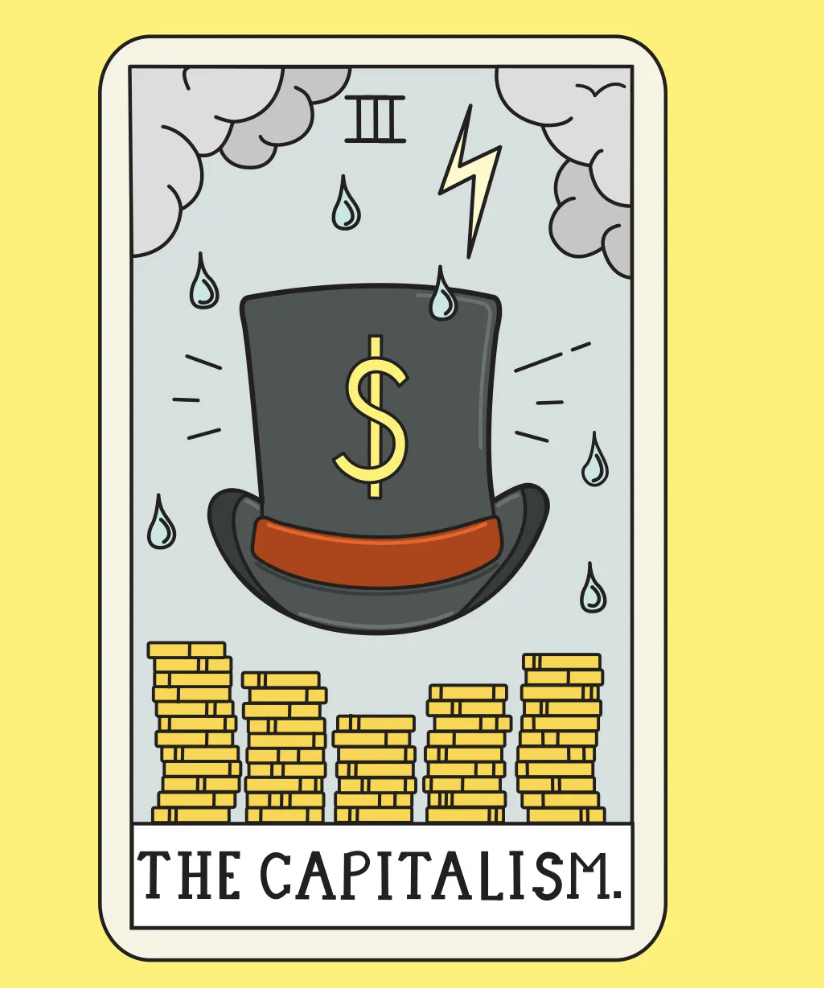

# Applied Data Science @ Columbia
## Fall 2022
## Project 1: A "data story" on the history of philosophy



### [Project Description](doc/)
This is the first and only *individual* (as opposed to *team*) project this semester. 

Term: Fall 2022

+ Projec title: A "data story" on the history of philosophy ---- capitalism analysis by author
+ This project is conducted by Yudan Zhang

+ Project summary: The goal of this project1 is going to provide analysis mainly on 3 authors (Keynes, Ricardo, Smith) from capitalism. The capitalism has a great impact on the American society. By exploring the words of the philosophers of capitalism, we might have a better understanding of how capitalism related to the American society & people, and wonder if the idea of capitalism changes over time. The 3 represents of capitalism included in this dataset are John Maynard Keynes, David Ricardo & Adam Smith.

Following [suggestions](http://nicercode.github.io/blog/2013-04-05-projects/) by [RICH FITZJOHN](http://nicercode.github.io/about/#Team) (@richfitz). This folder is orgarnized as follows.

```
proj/
├── lib/
├── data/
├── doc/
├── figs/
└── output/
```

Please see each subfolder for a README file.
